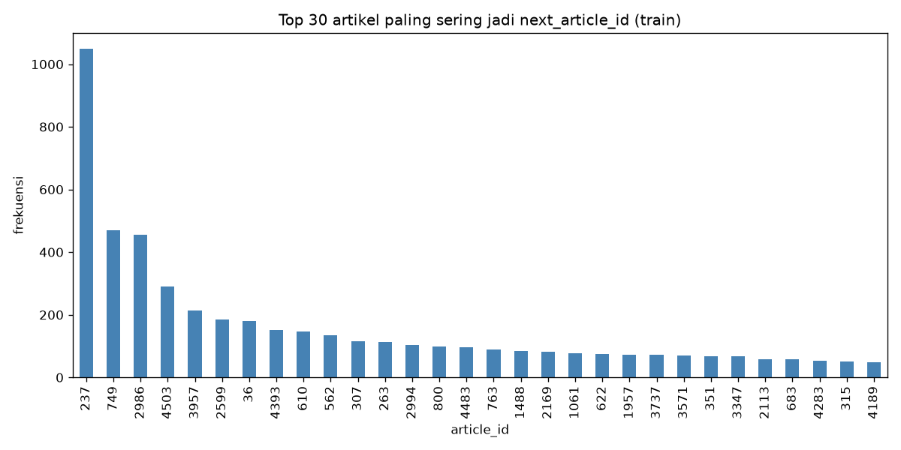
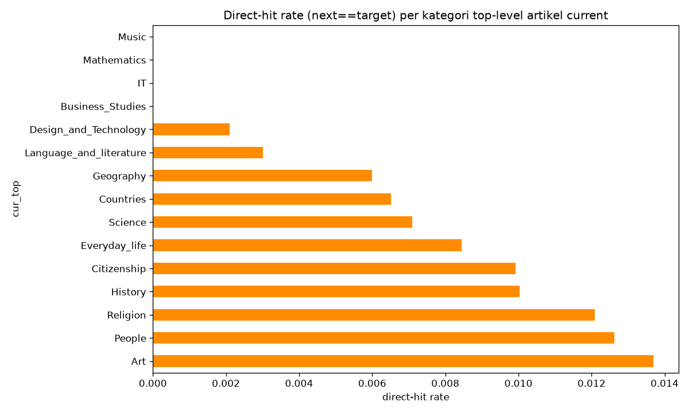
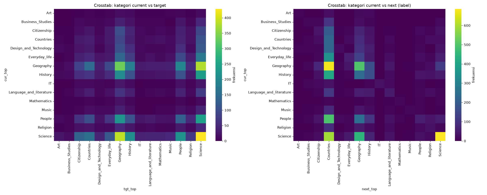
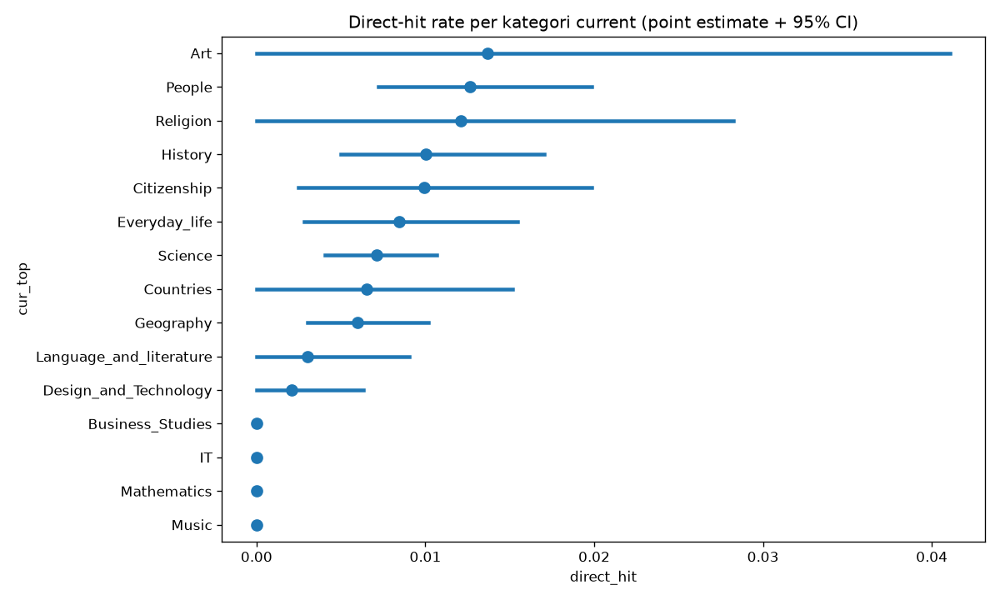

# Wikipedia Next-Click Prediction — Kaggle Datathon Task 2

[](https://www.python.org/)
[](https://pytorch.org/)
[](https://github.com/JaidedAI/EasyOCR)
[](https://scikit-learn.org/)
[](LICENSE)

Predicting **which Wikipedia link a navigator clicks next**, given their current article and the target article they are heading for — using **OCR** to "read" rendered page screenshots plus **TF-IDF text features** and a **tree + neural-network ensemble**.

> **Result:** 126th out of 282 teams · Team **TelyuAlgo**

---

## Overview

Reading Wikipedia is a *goal-directed walk*: start on one article, click through links until you reach a target. This competition frames that walk as **single-step prediction**:

> A navigator is on article **A** and heading for article **B**. Of all the links visible on page A, which one do they click next?

Each sample (`state`) is one situation `(current, target)`.

## Ringkasan (Bahasa Indonesia)

Membaca Wikipedia adalah "jalan menuju tujuan": mulai dari satu artikel lalu mengeklik link demi link hingga sampai ke target. Tugasnya memprediksi **link mana yang akan diklik berikutnya**, diberikan artikel saat ini (`current`) dan artikel tujuan (`target`).

> **Hasil:** peringkat 126 dari 282 tim · Tim **TelyuAlgo**

---

## Approach

```
Load data → EDA → OCR screenshots (EasyOCR) → Feature engineering (TF-IDF, candidate lookup)
          → Candidate extraction → Models (RF / HGB / LogisticRegression + MLP) → Ensemble → Submission
```

1. **EDA** (`assets/` below) — target class distribution, direct-hit rate, category crosstab, and point-plots (see images at the bottom of this README).
2. **OCR as a feature source** — screenshots of each Wikipedia page are run through **EasyOCR** (GPU/CUDA when available, cached to avoid re-running ~4,600 images). The extracted text acts as a proxy for the links actually visible on the page.
3. **Feature engineering**
   - Candidate extraction — match article titles against the OCR text of the current page.
   - TF-IDF over full OCR text + **cosine similarity** between current and target.
   - WoE/IV analysis, Gini impurity, and entropy for feature diagnostics.
   - `ColumnTransformer` with TF-IDF index + variance threshold + label encoding.
4. **Models**
   - Baselines: `LogisticRegression`, `RandomForestClassifier`, `HistGradientBoostingClassifier`.
   - `CandidateScorer` — a **binary MLP (PyTorch)** with BatchNorm + ReLU + Dropout, trained via backpropagation with `BCEWithLogitsLoss` and positive-class weighting.
5. **Ensemble** — grid-search over `α` to blend tree/linear model scores with MLP scores for the final ranking.

## EDA Outputs

| Target class distribution | Direct-hit rate | Category crosstab | Direct-hit point plot |
|---------------------------|-----------------|-------------------|-----------------------|
|  |  |  |  |

## Repository Structure

```
kaggle-wikipedia-click-prediction/
├── melatih.py      # full pipeline: load → EDA → OCR → features → models → ensemble → submission
├── assets/         # EDA output images
├── requirements.txt
├── LICENSE
└── README.md
```

## How to Run

> ⚠️ `melatih.py` reads data from `TASK2_DATA_DIR` (env var) or a hardcoded path.
> Set the env var before running:

```powershell
$env:TASK2_DATA_DIR = "path\to\dataset-task2"
pip install -r requirements.txt
python melatih.py
```

> OCR requires **EasyOCR** and will download its recognition models on first run. It caches results to avoid re-processing images.

## Technologies

- **Python**, NumPy, pandas
- **EasyOCR** (PyTorch-based) — text extraction from page screenshots
- **scikit-learn** — TF-IDF, `ColumnTransformer`, RandomForest, HistGradientBoosting, LogisticRegression
- **PyTorch** — `CandidateScorer` MLP
- **seaborn / matplotlib** — EDA visualizations

## Result

**126th out of 282** on the leaderboard (team **TelyuAlgo**).

## License

[MIT](LICENSE)
